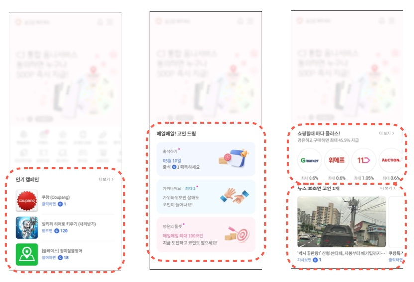

# 플레이스먼트뷰

유저들의 오퍼월 진입을 보다 자연스럽게 유도하기 위하여 매체 내에 전면이나 바텀시트 또는 피드 형태로 오퍼월 광고를 제공할 수 있습니다. 



플레이스먼트뷰는 원하는 유형의 광고, 쇼핑, 이벤트 등을 노출할 수 있으며 노출되는 광고의 갯수나 UI 등도 모두 원하는 형태로 커스터마이징이 가능합니다. 오퍼월에서 제공하는 큐레이션 기능을 별도의 뷰 형태로 제공한다고 보시면 됩니다.

## AdPlacementView

### 플레이스먼트뷰 생성하기

플레이스먼트뷰를 표시하기 위해서는 우선 사용할 플레이스먼트에 대한 설정이 필요합니다.
해당 설정은 홈페이지의 관리자 페이지에서만 가능하므로 등록이 필요하시면 별도 문의바랍니다.

플레이스먼트뷰에 광고를 로딩하기 위해서 아래와 같이 진행합니다. 아래의 예시는 placementContainerView 내에 플레이스먼트뷰를 표시하는 예시이며 "open_ad" 라는 플레이스먼트가 설정되어 있다고 가정합니다.

```swift
@IBOutlet 
var placementContainerView:UIView!
var adPlacementView:AdPlacementView?

func setupPlacementView() {
                
    let pView = AdPlacementView(frame: view.frame, viewController: self)
    pView.placementListener = self
        
    placementContainerView.addSubview(pView)
        
    pView.translatesAutoresizingMaskIntoConstraints = false
    NSLayoutConstraint.activate([
            pView.leftAnchor.constraint(equalTo: placementContainerView.leftAnchor),
            pView.rightAnchor.constraint(equalTo: placementContainerView.rightAnchor),
            pView.topAnchor.constraint(equalTo: placementContainerView.topAnchor),
            pView.bottomAnchor.constraint(equalTo: placementContainerView.bottomAnchor)
    ])
        
    adPlacementView = pView
}

func loadPlacementView() {
    adPlacementView?.loadData(placementId: "open_ad")
}

```

### 플레이스먼트 광고 표시

AdPlacementView 의 loadData() 를 호출하면 전달된 placement_id 에 설정된 값에 따라서 광고를 로딩합니다. 광고 로딩이 완료되면 PlacementEventListener 의 didAdDataLoaded() 가 호출됩니다.

아래는 PlacementEventListener 의 protocol 규약입니다.

```swift
/// AdPlacementView 내의 특정 이벤트들을 받아서처리 하기 위하여 사용됩니다.
/// AdPlacementView 객체의 placementListener 에 설정합니다.
public protocol PlacementEventListener : NSObjectProtocol {

    /// AdPlacementView 에 광고가 로딩되는 시점에 호출됩니다. 여기에 광고를 표시하는 로직을 구현합니다.
    ///
    /// - Parameters:
    ///    - placementId: 광고 로딩을 요청한 placement Id 값
    ///    - customData : 플레이스먼트 설정시 customData 항목에 입력한 값
    func didAdDataLoaded(placementId:String, customData:String?)
    
    /// AdPlacementView 에 광고 로딩이 실패하는 시점에 호출됩니다.
    ///
    /// - Parameters:
    ///   - placementId: 광고 로딩을 요청한 placement Id 값
    func didFailedToLoad(placementId:String)
    
    /// AdPlacementView 의 광고를 클릭하면 호출됩니다.
    ///
    /// - Parameters:
    ///   - appId : 클릭한 광고의 appId
    ///   - appName : 클릭한 광고의 명칭
    func didAdItemClicked(appId:Int, appName:String)
    
    /// 더보기 링크를 클릭하면 호출됩니다. 여기에 오퍼월을 띄우도록 구현합니다.
    func didMoreLinkClicked()
}
```

AdPlacementView 의 loadData() 를 호출하고 광고가 정상적으로 로딩되면 설정한 리스너의 didAdDataLoaded() 가 호출됩니다. 여기에서 해당 AdPlacementView 을 표시하도록 구현합니다. 그리고 플레이스먼트의 ID 와 해당 플레이스먼트에 설정된 customData 가 같이 전달되는데 이를 이용하면 customData 설정에 따라서 UI 를 다르게 표시하도록 구현할 수 있습니다.

아래의 예시는 didAdDataLoaded() 의 구현 예시입니다. 
로딩된 광고를 화면에 표시하기 위해서는 AdPlacementView 의 showAdList() 를 호출합니다. showAdList() 는 광고를 화면에 표시하고 표시되는 광고가 차지하는 화면의 크기를 CGSize 객체로 반환합니다.

```swift
func didAdDataLoaded(placementId: String, customData:String?) {
    let viewSize = adPlacementView?.showAdList()
    print("### placementId \(placementId) ad data loaded and show with size \(String(describing: viewSize))")
}
```

### customData 활용하기

서버에 설정된 customData 값에 따라서 다르게 UI 를 표시할 수 있습니다.

```swift
func didAdDataLoaded(placementId: String, customData:String?) {
        
    // 여기에서 customData 에 따라서 Layout 을 다르게 설정할 수 있다.
    if customData == "feed" {
            // feed UI
            TnkLayout.shared.registerPlacementViewLayout(placementId: placementId,
                                                         viewClass: FeedAdListItemView.self,
                                                         viewLayout: PlacementFeedViewLayout())
        }
        else {
            // list UI
            TnkLayout.shared.registerPlacementViewLayout(placementId: placementId,
                                                         viewClass: DefaultAdListItemView.self,
                                                         viewLayout: PlacementListViewLayout())
        }
        
        let viewSize = adPlacementView?.showAdList()
        
        print("### placementId \(placementId) ad data loaded and show with size \(String(describing: viewSize))")
    }

```

### AdPlacementView 의 UI 커스터마이징

플레이스먼트뷰의 UI 커스터마이징 방법은 기본적으로 오퍼월의 UI 커스터마이징과 동일합니다. 오퍼월의 UI 커스터마이징은 여기를 참고하세요. &rightarrow; [UI 커스터마이징 가이드](./UI_Customizing.md)

아래의 TnkLayout 함수를 사용하여 플레이스먼트 ID에 사용할 AdListItemView 와 AdListItemViewLayout 을 TnkLayout 에 등록합니다. 

```swift

// TnkLayout 메소드
// func registerPlacementViewLayout(placementId:String, viewClass: AnyClass, viewLayout:AdListItemViewLayout)

// 사용예시
TnkLayout.shared.registerPlacementViewLayout(placementId: "open_ad",
                                                     viewClass: IconOnlyAdListItemView.self,
                                                     viewLayout: PlacementIconViewLayout())

```

SDK 에서는 플레이스먼트뷰에 적합한 몇가지 레이아웃을 제공하고 있습니다. 아래는 제공되는 AdListItemView 와  ViewLayout 입니다.

#### 피드

#### 피드 (이미지만 표시)

#### 아이콘

#### 리스트

 
--- 

# 광고정보 조회 기능
광고 목록을 UI를 직접 구현하기 위한 기능 지원 

## 광고 목록 조회

#### Method

- AdPlacementView.getAdList() -> \[TnkPlacementAdItem\]


#### Description

PlacementView에 로드된 광고 목록을 반환합니다.

#### Parameters

#### Return : \[TnkPlacementAdItem\]
```swift
public struct TnkPlacementAdItem : Codable
{
    let app_id: Int                // Int 광고 고유 식별값
    let app_nm: String              // String 광고 제목
    let img_url: String             // String 이미지 url
    let pnt_amt: Int               // Int 지급 포인트 (이벤트 진행시 이벤트 배율 적용된 포인트)
    let org_amt: Int               // Int 배율 이벤트 진행 시 원래의 포인트(이벤트 기간 아닐경우 0)
    let pnt_unit: String           // String 포인트 재화 단위
    let prd_price: Int             // Int CPS상품 가격
    let org_prd_price: Int         // Int CPS상품 할인 전 가격
    let sale_dc_rate: Int           // Int CPS 상품 할인율
    let multi_yn: Bool           // Bool 멀티 미션 광고 여부
    let cmpn_type: Int              // Int 광고 유형코드
    let cmpn_type_name: String      // String 광고 유형 이름
    let like_yn: String              // String 즐겨찾기 상품 여부
}
```

## 광고 목록 조회(JSON)

### Method

- AdPlacementView.getAdListJson()  -> String?

#### Description

광고 목록 정보를 json으로 반환합니다.

## PlacementView 설정값 조회

#### Method

- AdPlacementView.getPubInfo()  -> TnkPlacementPubInfo

#### Description

PlacementView 설정값을 로드합니다.

#### Parameters

#### Return : TnkPlacementPubInfo

```swift
public struct TnkPlacementPubInfo : Codable{
    let ad_type: Int             // 지면에 설정되어 있는 광고 유형(0 : 보상형, 1 : CPS, 2 : 제휴몰, 3 : 뉴스, 4 : 이벤트)
    let title: String            // 지면 타이틀
    let more_lbl: String         // 더보기 라벨
    let cust_data: String        // 매체 설정값
    let ctype_surl: String       // 캠페인타입 정보 URL (해당 URL 호출시 json 반환) {list_count:int, list:[{cmpn_type:int, cmpn_type_nm:string},….]}
    let pnt_unit: String         // 매체 포인트 명칭
    let plcmt_id: String         // 매체 설정 지면 ID
}
```

## PlacementView 설정값 조회(JSON)

#### Method

- AdPlacementView.getPubInfoJson() -> String?

#### Description

PlacementView 설정값을 Json으로 반환합니다.

## 광고 클릭 이벤트 처리

#### Method

- AdPlacementView.onItemClick(appId : Int)

#### Description

광고 목록 정보를 가지고 직접 광고 목록을 출력 할 경우 onItemClick 메소드를 통해 광고 클릭 이벤트를 처리합니다.
광고상세 페이지 랜딩(네이티브), 광고주가 제공한 웹 사이트로 이동 등 각 광고 타입별 액션이 실행됩니다.
액션 처리가 완료되면 PlacementEventListener protocol의 didAdItemClicked(...) 함수로 이벤트 처리 결과가 반환됩니다.

#### Parameters

| 파라메터 명칭 | 내용                                                         |
| -------------- | ----------------------------------------------------------- |
| appId       | 클릭 이벤트를 처리 할 광고의 appId                              |

## 샘플코드 

```swift

import UIKit
import TnkRwdSdk2
import AppTrackingTransparency

class ViewController: UIViewController {

  ...

  //플레이스 먼트 세팅
  func setupPlacementView()
  {
      let placementView = AdPlacementView(frame: self.view.frame, viewController: self)
      placementView.layer.cornerRadius = 20
      placementView.placementListener = self
      view.addSubview(placementView)
      
      placementView.translatesAutoresizingMaskIntoConstraints = false
      NSLayoutConstraint.activate([
          placementView.leftAnchor.constraint(equalTo: self.view.leftAnchor, constant: 20),
          placementView.rightAnchor.constraint(equalTo: self.view.rightAnchor, constant: -20),
          placementView.centerYAnchor.constraint(equalTo: self.view.centerYAnchor),
      ])
      
      adPlacementView = placementView
      adPlacementView?.loadData(placementId: adPlacementId)
  }

  //광고 상세 노출
  func showPlacementAdDetail(appId : Int)
  {
      adPlacementView?.onItemClick(appId: appId)
  }
  
}

//이벤트 리스너 protocol
extension ViewController : PlacementEventListener
{
  func didAdDataLoaded(placementId: String, customData: String?) {
    if let adList = self.adPlacementView?.getAdList()
    {
        //광고 정보
    }

    if let jsonList = self.adPlacementView?.getAdListJson()
    {
        //광고 정보 - json
    }
    
    if let pub = self.adPlacementView?.getPubInfo()
    {
        //placement 설정값
    }

    if let pubJson = self.adPlacementView?.getPubInfoJson()
    {
        //placement 설정값 - json
    }
  }
}

```


## 이벤트 기능

매체의 사용자 유입 및 리텐션을 높이기 위하여 플레이스먼트에서는 몇가지 이벤트를 기본제공하고 있습니다.
현재 제공되는 이벤트의 종류와 기능은 아래와 같습니다.

### 출석체크

하루 한번 출석체크를 통하여 무료포인트를 획득할 수 있는 기능입니다. 출석 당 지급 포인트와 연속 출석일수에 따른 추가 포인트가 지급되며 지급되는 포인트는 모두 설정이 가능합니다.

피드이미지, 이벤트 페이지 이미지

### 행운의 룰렛

하루 지정된 횟수만큼 룰렛 참여가 가능합니다. 룰렛은 정해진 확률에 따라서 설정된 포인트가 지급됩니다. 지급 포인트와 해당 확율 그리고 하루 참여 횟수는 모두 설정이 가능합니다.


### 가위바위보

가위바위보 게임을 통하여 사용자는 무료 포인트 획득이 가능합니다. 승/무/패 확률과 승리시 지급 포인트는 모두 설정이 가능합니다.


## 샘플
