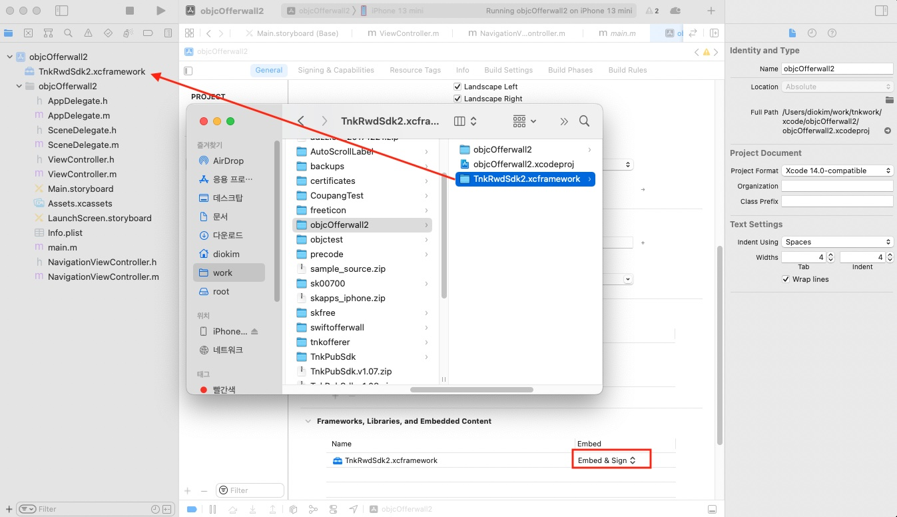

# 카카오 페이플러스 연동 가이드 (iOS)

카카오 페이포인트와 연계된 보상형 오퍼월 기능이 개발되었습니다. 커스터 스키마 적용과 간단한 SDK 함수 호출을 통해 보상형 광고 화면이 노출 가능합니다.

## 1.SDK 설정하기

해당 기능의 SDK 관련 framework 삽입 및 설정 방법은 기존의 방법과 같습니다. 1.1~1.4의 안내 지침을 따라 SDK 설정후 아래 내용을 따라 설정해주시기 바랍니다.

### 1.1 커스텀 스키마 xcode 등록{#register_scheme}

카카오톡 앱과의 연동을 위해 카카오 앱에서 호출할 신규 스키마를 등록해야 합니다. 해당 과정은 카카오톡과 회원정보,페이포인트와 연동하기 위한 필수 과정입니다.
Xcode > Target > Info > URL Types에 신규 Scheme를 등록합니다.

**이때 등록할 Scheme값은 타사 앱에서 등록한 스키마와 겹치지 않게 고유한 값을 기입해 주시기 바랍니다.**

아래의 이미지를 참고해 주시기 바랍니다.


### 1.2 페이플러스 인스턴스 초기화

오퍼월 화면 노출은 페이플러스 인스턴스를 통해 이루어집니다. 해당 인스턴스 사용을 위해서는 사전에 **APP-ID** 값을 발급 받으셔야합니다.  **APP-ID** 값은 [Tnk 사이트](https://tnkfactory.com) 에서 발급 받으 실 수 있습니다. **APP-ID** 값을 발급 받으셨다면 이 값을 사용하여 KaKaoTnkRwdPlus 객체가 초기화되어야합니다.
이때 [커스텀 스키마 등록](#register_scheme)

```swift
// Swift
import TnkRwdSdk2

let kakaoPlus = KaKaoTnkRwdPlus.initSession(appId: "your-app-id-from-tnk-site")
                                .setUrlScheme("OFFERWALLTEST")
```
