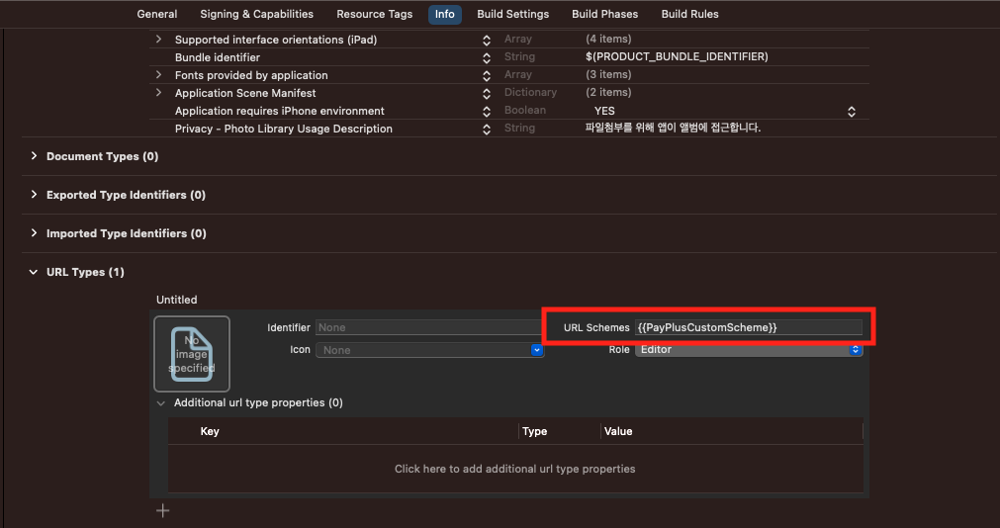

# Payplus guide(iOS)

PayPlus is the reward type offerwall function linked with Kakao Pay Point. The reward ad screen can be exposed through custom scheme application and simple SDK function call.

## 1. SDK Get Started

The SDK-related framework insertion and configuration method is the same as before. Please follow the instructions in [SDK Application Guide](https://github.com/tnkfactory/ios-sdk-rwd2/blob/main/iOS_Guide_en.md)

### 1.1 Custom Scheme Xcode Registration

In order to integrate with KakaoTalk, you need to register a new scheme to be called by the Kakao app. This process is a mandatory process for integrating KakaoTalk with member information and PayPlus.

Xcode > Target > Info > URL Types register a new Scheme.

**At this time, please enter a unique value that does not overlap with the scheme registered by other companies.**

Please refer to the image below.


### 1.2 PayPlus Instance Initialization

The offerwall screen is displayed through the PayPlus instance. In order to use this instance, you must first issue an **APP-ID** value. **APP-ID** value can be issued from [Tnk site](https://tnkfactory.com). If you have received the **APP-ID** value, the KaKaoTnkRwdPlus object must be initialized using this value. At this time, the unique Scheme value registered in the [Custom Scheme Registration](#11-custom-scheme-xcode-registration) process must be initialized together using the setUrlScheme function.

```swift
import TnkRwdSdk2

let kakaoPlus = KaKaoTnkRwdPlus.initSession(appId: "your-app-id-from-tnk-site")
                                .setUrlScheme("{{PayPlusCustomScheme}}")
```

### 1.3 Scheme Callback Function Integration

You need to process the scheme after the login is completed from the Kakao Pay app in order to receive the data. The code that processes the received scheme url is as follows.
(If the result of the proceedUrlDelegate function below is false, it is not a PayPlus url.)

* Use AppDelegate

```swift
import UIKit
import TnkRwdSdk2

@main
class AppDelegate: UIResponder, UIApplicationDelegate {

    var window: UIWindow?

    func application(_ app: UIApplication, open url: URL, options: [UIApplication.OpenURLOptionsKey : Any] = [:]) -> Bool {
        return KaKaoTnkRwdPlus.proceedUrlAppDelegate(open: url)
    }
}
```

* Use SceneDelegate

```swift
import TnkRwdSdk2
import UIKit

class SceneDelegate: UIResponder, UIWindowSceneDelegate {

    @available(iOS 13, *)
    func scene(_ scene: UIScene, openURLContexts URLContexts: Set<UIOpenURLContext>) {
        _ = KaKaoTnkRwdPlus.proceedUrlSceneDelegate(openURLContexts: URLContexts)
    }
}
```  


### 1.4 Show Offerwall

If you have completed the above process 1.3, you can expose the ad screen by calling the showOfferWall function of the instance created through the process [1.2](#12-payplus-instance-initialization).

```swift
import TnkRwdSdk2

let kakaoPlus = KaKaoTnkRwdPlus.initSession(appId: "your-app-id-from-tnk-site")
                                .setUrlScheme("{{PayPlusCustomScheme}}")
kakaoPlus.showOfferwall(self)

```
