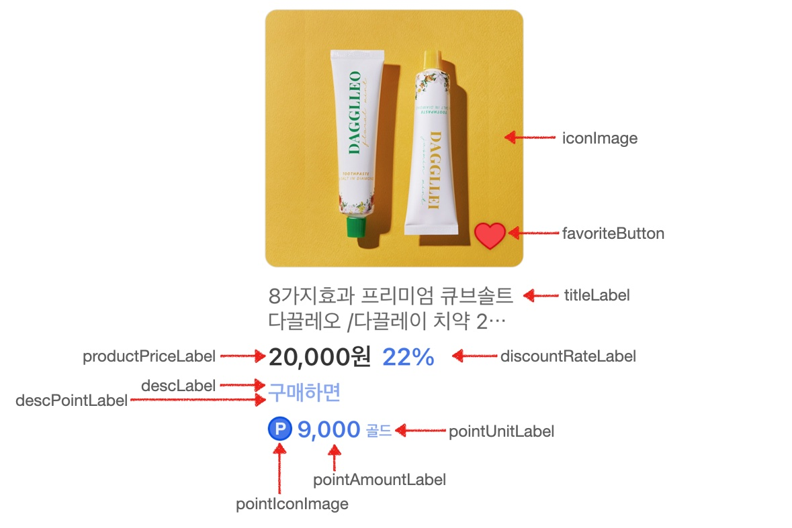

# 신규 오퍼월 UI 커스터마이징 가이드

새로운 보상형 SDK는 사용자에게 적절한 광고를 보다 효과적으로 제공하기 위하여 기본 광고 목록외에 추가로 다양한 큐레이션 UI 를 제공합니다. 큐레이션은 사용자가 참여 중인 멀티리워드 광고, 새로 등록된 광고, 사용자 추천 광고 등을 페이징 방식, 횡스크롤 방식 등으로 기본 광고 목록과 구별되는 방식으로 제공함으로써 사용자의 주목도를 높일 수 있습니다.

새로운 SDK를 적용하기 위한 개발 가이드는 여기를 참고하세요. &rightarrow; [SDK 적용 가이드](./iOS_Guide.md)

#### 일반 광고 UI 예시


#### 구매형 광고 UI 예시


신규 SDK에는 여러 종류의 큐레이션 UI 를 쉽게 커스터마이징 할 수 있는 다수의 View 와 Layout 들이 만들어져 있으며, 개발사가 원할 경우 완전히 다른 형태의 UI 도 구현될 수 있도록 기능을 제공하고 있습니다.

## 1. 기본 광고 목록

광고 목록 표시를 위하여 AdListItemView 와 AdListItemViewLayout 이 사용됩니다. AdListItemView는 하나의 광고 아이템이 표시되는 View 이며 내부에 아이콘 이미지, 타이틀 , 포인트 등의 구성 요소들이 배치되어 있습니다. 

AdListItemViewLayout 은 AdListItemView 내의 구성요소들의 크기, 색상, 폰트, 간격 등을 정의하고 있으며 추가로 해당 광고 아이템이 표시되는 섹션(또는 큐레이션)의 컬럼 수, 스크롤 방식, 헤더, 푸터 등의 추가적인 요소를 표현하기 위한 설정 값을 제공하고 있습니다.

### DefaultAdListItemView

아래의 이미지와 같은 형태의 배치를 가지고 있으며 기본 광고 목록을 표시하기 위하여 사용됩니다. 


iconImage 와 pointIconImage 는 UIImageView 가 사용되며 아래와 같은 속성을 가지고 있습니다. 추가로 AdListItemView 가 피드형태로 표시되는 경우에는 feedImage 추가로 사용됩니다.

##### ImageAttribute

```swift
class ImageAttribute  {
    var width:CGFloat = 10                 // 이미지의 가로 크기
    var height:CGFloat = 10                // 이미지의 새로 크기
    var backgroundColor:UIColor = .clear   // 이미지의 배경색
    var cornerRadius:CGFloat = 0           // 이미지의 코너 라운드 처리를 위한 반지름 값
    var strokeColor:UIColor = .clear       // 이미지의 테두리 색상
    var strokeWidth:CGFloat = 0            // 이미지의 테두리 두께
    var interSpace:CGFloat = 0             // 위에 있는 구성 요소와의 간격
    var leadingSpace:CGFloat = 0           // 앞에 있는 구성 요소와의 간격
    var imageNormal:UIImage? = nil         // 표시할 이미지
    var imageHighlighted:UIImage? = nil    // highlighted 상태에서 표시할 이미지
    var imageDisabled:UIImage? = nil       // disabled 상태에서 표시할 이미지
}
```

titleLabel, descLabel, descPointLabel, pointAmountLabel, pointUnitLabel 은 UILabel 이 사용되며 아래와 같은 속성을 가지고 있습니다. 참고로 descPointLabel 은 descLabel 과 같은 UILabel 객체를 사용하며 2배 이벤트를 진행할 때 원래 지급 포인트를 표시하기 위하여 사용되는 속성입니다.

##### LabelAttribute

```swift
class LabelAttribute {
    var width:CGFloat = -2          // 라벨의 너비, 음수로 지정하면 text 에 맞추진다.
    var height:CGFloat = 10                            // 라벨의 높이
    var font:UIFont = TnkFonts.getFont(ofSize: 14)     // 라벨의 text 에 사용되는 폰트
    var color:UIColor = .clear                         // 라벨의 text 에 사용되는 색상
    var backgroundColor:UIColor = .clear               // 라벨의 배경색
    var cornerRadius:CGFloat = 0                       // 라벨의 코너 라운드 처리를 위한 반지름 값
    var strokeColor:UIColor = .clear                   // 라벨의 테두리 색상
    var strokeWidth:CGFloat = 0                        // 라벨의 테두리 두께
    var interSpace:CGFloat = 0                         // 위에 있는 구성 요소와의 간격
    var leadingSpace:CGFloat = 0                       // 앞에 있는 구성 요소와의 간격
    var numberOfLines:Int = 1                          // 라벨의 numberOfLines 값
}
```

### AdListItemViewLayout

AdListItemViewLayout 은 앞서 설명한 구성요소(iconImage, titleLabel, descLabel 등)들의 속성값을 정의하는 것 외에 아래와 같은 값들을 정의합니다. (아래에 나열된 항목 외에도 구매형 광고를 위한 속성과 표시되는 광고 아이템의 스크롤 방향, 섹션 헤더와 푸터 등에 대한 설정 값이 존재합니다. 이 부분은 나중에 설명드리겠습니다.)

```swift
class AdListItemViewLayout  {
    
    // 섹션 영역의 Inset
    var sectionInset:UIEdgeInsets = UIEdgeInsets(top: 0, left: 10, bottom: 0, right: 10)

    var useIconImage:Bool = true       // AdListItemView 에서 iconImage 가 사용되면 true 로 설정
    var useFeedImage:Bool = false      // AdListItemView 에서 feedImage 가 사용되면 true 로 설정

    var itemCornerRadius:CGFloat = 0       // AdListItemView 의 코너 라운드 처리
    var itemStrokeColor:UIColor = .clear   // AdListItemView 의 테두리 색상
    var itemStrokeWidth:CGFloat = 0        // AdListItemView 의 테두리 두께
    
    var itemBackgroundColor:UIColor = .white   // AdLisItemview 의 배경색
    var itemHighlightedColor:UIColor = UIColor(argb: 0xa0f8f8f8)   // AdListItemView 가 눌렸을 때의 배경색
    
    // AdListItemView 내부의 Inset 값
    var itemInset:UIEdgeInsets = UIEdgeInsets(top: 6, left: 10, bottom: 7, right: 10)
    var lineSpace:CGFloat = 0      // AdListItemView 들의 위아래 사이 간격
    var itemSpace:CGFloat = 0      // AdListItemView 들의 좌우 사이 간격

    var pointUnitVisible:Bool = true  // pointUnitLabel 을 보여줄지 여부 설정
    var pointAmountDisabledColor:UIColor = .gray // 적립완료 등 참여 불가인 경우 표시문구 색상
    var pointAmountConfirmColor:UIColor = .blue // 설치확인 문구 색상

    // 구분선(divider)
    var dividerHeight:CGFloat = 1	                     // 구분선 두께
    var dividerColor:UIColor = UIColor(argb: 0xfff2f2f2) // 구분선 색상
    var dividerLeadingSpace:CGFloat = 20 + 72 + 12       // 구분선 앞의 여백
    var dividerTrailingSpace:CGFloat = 20                // 구분선 뒤의 여백
    var dividerHiddenAtLastItem:Bool = true              // 맨 밑에 있는 아이템의 divider 는 숨기기
```
### 레이아웃 등록하기

필요한 AdListItemView 와 AdListItemViewLayout 이 만들어 졌다면 이를 어떤 큐레이션에 사용할지 등록해야 합니다. 이를 위하여 TnkLayout 을 사용합니다. 아래에는 기본 광고 목록에 DefaultAdListItemView 와 AdListItemViewLayout 을 연결하는 예시입니다.

```swift
// TnkLayout 메소드
// func registerItemViewLayout(type:LayoutType, viewClass: AnyClass, viewLayout:AdListItemViewLayout)

// 사용예시
TnkLayout.shared.registerItemViewLayout(type: .normal, viewClass: DefaultAdListItemView.self, viewLayout: AdListItemViewLayout())
```
LayoutType 은 일반 광고 목록이나 큐레이션 등의 종류를 정의하고 있습니다. [LayoutType 보기](./Layout_Type.md)

지금까지 설명한 것을 바탕으로 기본 목록의 UI 구성을 변경해보겠습니다. 아래의 예시에서는 기본 광고 목록을 표시하기 위하여 SDK 가 제공하는 DefaultAdListItemView 를 사용하였으며 여기에 아이콘 이미지의 크기와 모서리, 테두리 설정을 변경하고 타이틀의 폰트 크기와 색상 등을 변경하였습니다.

```swift
@IBAction
func onClickOfferwall() {
     
    let viewLayout = AdListItemViewLayout()
        
    // iconImage 의 크기 변경, 라운드 없이 각지게 표시, 테두리 검은색으로 2 pixel
    viewLayout.iconImage.width = 80
    viewLayout.iconImage.height = 80
    viewLayout.iconImage.cornerRadius = 0
    viewLayout.iconImage.strokeWidth = 2
    viewLayout.iconImage.strokeColor = .black
        
    // titleLabel 의 폰트 크기, 색상 변경
    viewLayout.titleLabel.font = UIFont.systemFont(ofSize: 17) // 기본값 14
    viewLayout.titleLabel.color = .orange
        
    // 포인트 명칭 숨기기
    viewLayout.pointUnitVisible = false
        
    // descLabel 안쪽으로 더 밀어넣기 (기본값 12)
    viewLayout.descLabel.leadingSpace = 15
        
    // divider 두께 변경 및 양쪽 여백 없애기
    viewLayout.dividerHeight = 2
    viewLayout.dividerLeadingSpace = 0 // sectionInset.left 가 10 이라 앞에 여백은 남음
    viewLayout.dividerTrailingSpace = 0
        
    // Layout 등록
    TnkLayout.shared.registerItemViewLayout(type: .normal, viewClass: DefaultAdListItemView.self, viewLayout: viewLayout)
             
    showOfferwall()
        
}
```


### RightIconAdListItemView, FeedAdListItemView

기본 광고 목록 표시를 위하여 SDK 제공하는 AdListItemView 의 구현 클래스에는 RightIconAdListItemView 와 FeedAdListItemView 가 있습니다. RightIconAdListItemView 는 아이콘이 오른쪽에 배치되는 형태의 View 이며 FeedAdListItemView 는 피드 형태로 표시하기위한 View 입니다.  각각은 아래와 같은 배치를 가지고 있습니다.


RightIconAdListItemView 를 기본 광고 목록으로 지정하는 예시와 FeedAdListItemView 를 기본 광고 목록으로 지정하는 예시 코드를 참고하세요.

```swift
@IBAction
func onClickOfferwall1() {
    
    let viewLayout = AdListItemViewLayout()

    viewLayout.sectionInset = UIEdgeInsets(top: 0, left: 10, bottom: 0, right: 10)
    viewLayout.itemInset = UIEdgeInsets(top: 6, left: 10, bottom: 7, right: 10)
    viewLayout.dividerLeadingSpace = 10
    viewLayout.dividerTrailingSpace = 10
    
    // RightIconAdListView 를 기본 광고 목록으로 설정
    TnkLayout.shared.registerItemViewLayout(type: .normal, viewClass: RightIconAdListItemView.self, 
                                            viewLayout: viewLayout)
     
    showOfferwall()        
}

@IBAction
func onClickOfferwall2() {
    // FeedAdListItemView 를 기본 광고 목록으로 설정
    TnkLayout.shared.registerItemViewLayout(type: .normal, viewClass: FeedAdListItemView.self, 
                                            viewLayout: FeedAdItemLargeViewLayout())

    showOfferwall()
}
```

### 횡 스크롤 설정하기

목록의 스크롤 방향을 가로 방향으로 하고 싶은 경우 AdListItemViewLayout 클래스를 상속받아 itemColumns() 함수를 override 합니다. 그리고 orthogonalScrolling 값과 itemDirection 값을 아래와 예시와 같이 설정합니다. 

itemColumns() 함수는 길이가 2인 Int 배열을 반환하는데 첫번째 값으로 표시할 컬럼 수를 반환합니다. 횡스크롤인 경우에는 Row 수를 의미합니다. 두번째 값은 페이징 처리에서 사용되는 값이며 페이징이 아닌 경우에는 0으로 설정하면 됩니다. itemColumns() 함수의 파라메터로 numberOfItems 값이 전달되는 데 이 값은 표시되는 광고 갯수이므로 이 갯수에 따라서 컬럼 수를 조절하여 반환하실 수 있습니다.

```swift
class FeedAdItemScrollViewLayout: AdListItemViewLayout {
    
    override public init() {
        super.init()
        
        itemDirection = 1  // 아이템 배치 순서를 위에서 아래 방향으로 설정
        
        orthogonalScrolling = .continuous. // .paging 또는 .groupPaging 설정 가능
        
        // ...
   }

    override public func itemColumns(_ parentSize:CGSize, numberOfItems:Int) -> [Int] {
        if numberOfItems > 3 {
            return [2,0]    // 광고 갯수가 4개 이상인 경우는 2줄로 표시
        }
        else {
            return [1,0]   // 광고 갯수가 3개 이하인 경우는 1줄로 표시
        }
    }
```

아래는 SDK 가 제공하는 FeedAdListItemView 와 FeedAdItemScrollViewLayout 을 사용하여 기본목록을 횡스크롤 피드형태로 표시하는 Layout 설정 예시입니다.

```swift
let viewLayout = FeedAdItemScrollViewLayout()

viewLayout.sectionHeaderViewClass = nil // 섹션 헤더 표시하지 않기
viewLayout.sectionFooterViewClass = nil // 섹션 푸터 표시하지 않기

TnkLayout.shared.registerItemViewLayout(type: .normal, viewClass: FeedAdListItemView.self, viewLayout: viewLayout)
```


### 큐레이션 Layout 설정

큐레이션의 Layout 설정은 기본 광고 목록의 Layout 설정과 동일합니다. TnkLayout 의 registerViewLayout 의 첫번째 파라메터로 설정하고 싶은 큐레이션의 LayoutType 을 지정하면 됩니다. [LayoutType 보기](./Layout_Type.md)

아래의 예시는 신규 광고 큐레이션을 RightIconAdListItemView 를 사용하여 페이징으로 표시하도록 설정하는 예시입니다.

```swift
TnkLayout.shared.registerItemViewLayout(type: .newapps, viewClass: RightIconAdListItemView.self, viewLayout: RoundAdItemPageViewLayout())
```

SDK 가 제공하는 AdListItemView 와 AdListItemViewLayout 클래스의 전체 목록과 기본 설정값은 여기를 참고하세요. &rightarrow; [Laytout 클래스 목록](./Layout_Classes.md)

## 2. 구매형 광고 목록

### CpsBoxItemView

구매형 광고 목록을 위하여 CpsBoxItemView 가 기본적으로 사용됩니다. CpsBoxItemView 는 아래와 같은 배치를 가지고 있으며 productPricelLabel, discountRateLabel, favoriteButton 의 추가적인 구성요소를 가지고 있습니다.



productPriceLabel 과 discountRateLabel 은 UILabel 이 사용되며 [LabelAttribute](#LabelAttribute) 속성을 가지고 있습니다.

## 3. TnkStyle

## 4. 새로운 Layout 구현하기

작성 중...
