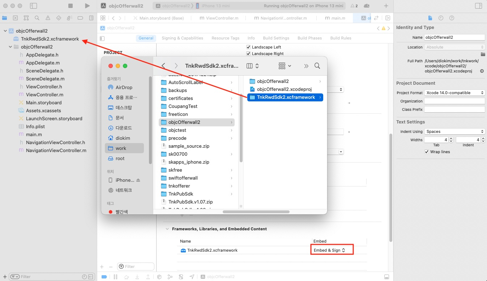

# 신규 오퍼월 SDK 적용 가이드 (iOS)

새로운 보상형 SDK는 기존의 보상형 SDK 를 대치하기 위하여 Swift 기반으로 완전히 새롭게 개발되었습니다. 기존 SDK가 단순히 광고 목록만 제공하였다면 새로운 SDK 는 단순 광고 목록 외에 추가로 다양한 광고 큐레이션을 제공하며 멀티리워드 캠페인 기능이 추가되었습니다. 멀티 리워드 캠페인은 1회성으로 리워드가 지급되는 기존 광고와는 다르게 사용자의 지속적인 참여를 유도할 수 있도록 개발된 광고 기능입니다. 

기존의 보상형 SDK 가이드 문서가 필요하시다면 여기를 참고하세요. &rightarrow; [구 보상형 SDK 가이드](https://github.com/tnkfactory/ios-sdk-rwd/blob/master/iOS_Guide.md)

새로운 SDK 의 UI 기능을 확인하시려면 여기를 참고하세요. &rightarrow; [UI 커스터마이징 가이드](./UI_Customizing.md)

## 목차

1. [SDK 설정하기](#1-sdk-설정하기)
   * 1.1 [라이브러리 다운로드](#11-라이브러리-다운로드)
   * 1.2 [라이브러리 등록](#12-라이브러리-등록)
   * 1.3 [앱 추적 동의](#13-앱-추적-동의)
   * 1.4 [권한 안내 문구 설정](#14-권한-안내-문구-설정)
   * 1.5 [Tnk 객체 초기화](#15-Tnk-객체-초기화)
2. [오퍼월 띄우기](#2-오퍼월-띄우기)
   * 2.1 [사용자 식별값 설정](#21-사용자-식별값-설정)
   * 2.2 [AdOfferwallViewController](#22-AdOfferwallViewController)
   * 2.3 [AdOfferwallView](#23-AdOfferwallVew)
      * [OfferwallEventListener](#OfferwallEventListener)
   * 2.4 [SwiftUI 에서 사용하기](#24-SwiftUI-에서-사용하기)
3. [Publisher API](#3-Publisher-API)
   * 3.1 [광고 상태 조회 - QueryPublishState](#31-광고-상태-조회---QueryPublishState)
   * 3.2 [적립가능한 포인트 조회 - queryAdvertiseCount](#32-적립가능한-포인트-조회---queryAdvertiseCount)
   * 3.3 [포인트 조회 및 인출](#33-포인트-조회-및-인출)
	  *  [포인트 조회 - queryPoint](#포인트-조회---queryPoint) 
	  *  [포인트 사용 - purchaseItem](#포인트-사용---purchaseItem)
	  *  [포인트 전체 인출 - withdrawPoints](#포인트-전체-인출---withdrawPoints)
   * 3.4 [Callback URL 설정하기](#34-Callback-URL-설정하기)
4. [디자인 커스터마이징](#4-디자인-커스터마이징)
5. [플레이스먼트 뷰](#5-플레이스먼트-뷰)
6. [Analytics Report](#6-Analytics-Report)
   
## 1. SDK 설정하기

### 1.1 라이브러리 다운로드

**[[iOS Reward SDK2 Download v5.53](./sdk/TnkRwdSdk2.v.5.53.zip)]**

### 1.2 라이브러리 등록

다운로드 받은 SDK 압축파일을 풀면 TnkRwdSdk2.xcframework 폴더가 생성됩니다. TnkRwdSdk2.xcframework 폴더를 XCode 내에 마우스로 드래그합니다. 이후 XCode -> Target -> General -> Frameworks, Libraries, and Embedded Content 항목에 TnkRwdSdk2.xcframework 가 있는 것을 확인하시고 Embed 설정을 Embed & Sign 으로 변경합니다.

아래의 이미지를 참고하세요.



### 1.3 앱 추적 동의

앱 광고의 경우 유저들의 광고 참여여부를 확인하기 위해서는 사전에 앱추적동의를 받아야합니다.  앱추적동의는 iOS 14부터 제공되는 기능으로 기기의 IDFA 값 수집을 위하여 필요합니다. 앱 추적 동의 창은 가급적이면 개발하시는 앱이 시작되는 시점에 띄우는 것을 권고드립니다.  [앱 추적동의에 대하여 더 알아보기](https://developer.apple.com/kr/app-store/user-privacy-and-data-use/)

앱 추적 동의에 거부한 유저에게는 광고가 제한적으로 노출됩니다.

#### 앱 추적 동의 창 띄우기

앱 추적동의 창을 띄우기 위해서는 우선 info.plist 파일에 아래와 같이 "Privacy - Tracking Usage Description" 문구를 추가합니다.  추가한 문구는 앱 추적 동의 팝업 창에 노출됩니다.

작성 예시) 사용자에게 최적의 광고를 제공하기 위하여 광고활동 정보를 수집합니다.
 


아래의 API 를 호출하여 앱 추적 동의 창을 띄울 수 있습니다. [AppTrackingTransparency API 가이드 보기](https://developer.apple.com/documentation/apptrackingtransparency)

```swift
import AppTrackingTransparency

if #available(iOS 14, *) {
    ATTrackingManager.requestTrackingAuthorization { status in
                // ...
    }
 }
```

또는 SDK 가 제공하는 API 를 사용하여 앱 추적동의 창을 띄울 수 있습니다. (앱이 active 되는 시점에 맞추어 앱 추적동의 창을 띄워줍니다.)

```swift
import TnkRwdSdk2

TnkAlerts.showATTPopup(viewController,
                       agreeAction: {
                           // 사용자 동의함
                       },
                       denyAction:{
                           // 동의하지 않음
                       })

```


### 1.4 권한 안내 문구 설정

오퍼월에 제공되는 광고 중에는 이미지 파일을 첨부를 필요로하는 광고들이 많이 있습니다. 이미지 파일 첨부를 위해서는 info.plist 파일에 포토 앨범 접근 권한 안내 문구(Privacy - Photo Library Usage Description)와 카메라 접근 권한 안내 문구(Privacy - Camera Usage Description) 설정이 필요합니다. 

아래의 이미지를 참고하여 설정해주세요.


### 1.5 Tnk 객체 초기화

SDK 사용을 위해서는 사전에 **APP-ID** 값을 발급 받으셔야합니다.  **APP-ID** 값은 [Tnk 사이트](https://tnkfactory.com) 에서 발급 받으 실 수 있습니다. **APP-ID** 값을 발급 받으셨다면 이 값을 사용하여 TnkSession 객체가 초기화되어야합니다. 이를 위해서는 2가지 방법이 존재합니다. 아래 2가지 방법 중 하나를 선택하시어 진행하시면 됩니다.

#### 초기화 API 호출하기

SDK 가 사용되기 전에 (일반적으로는 Application Delegate 의 applicationDidFinishLaunchingWithOption 메소드 내) 아래와 같이 초기화 로직을 넣습니다. 실제 **APP-ID** 값을 아래 로직의 **your-app-id-from-tnk-site** 부분에 넣어주어야합니다.

```swift
// Swift
import TnkRwdSdk2

TnkSession.initInstance(appId: "your-app-id-from-tnk-site")
```

```objective-c
// Objective-C
#import <TnkRwdSdk2/TnkRwdSdk2.h>

[TnkSession initInstanceWithAppId:@"your-app-id-from-tnk-site"];
```

#### info.plist 파일에 등록하기

XCode 프로젝트의 info.plist 파일내에 아래와 같이 `tnkad_app_id` 항목을 추가하고 **APP-ID** 값을 설정합니다. 이곳에 설정해두면 TnkSession 객체가 처음 사용되는 시점에 해당 **APP-ID** 값을 사용하여 자동으로 초기화됩니다.


## 2. 오퍼월 띄우기

### 2.1 사용자 식별값 설정

오퍼월을 띄우기 위해서는 우선 앱내에서 사용자를 식별할 수 있는 값을 SDK 에 설정하여야합니다. 사용자 식별값은 일반적으로 로그인 ID 와 같은 값이 사용됩니다. 만약 사용자 식별값이 전화번호나 이메일 등 개인 정보에 해당된다면 SHA256 과 같은 해쉬함수나 암호화 함수를 사용하여 주실것을 권장합니다.

사용자 식별값을 설정하지 않는 경우에는 오퍼월에는 광고가 출력되지 않습니다. 또한 사용자가 포인트 적립시 개발사의 서버로 호출되는 callback 내에 사용자 식별값이 같이 전달되므로 반드시 사용자 식별값을 설정하셔야합니다.

아래와 같이 호출하시어 사용자 식별값을 설정해주세요.

```swift
// Swift
import TnkRwdSdk2

TnkSession.sharedInstance()?.setUserName("<사용자 식별값>")
```

```objective-c
// Objective-C
#import <TnkRwdSdk2/TnkRwdSdk2.h>

[[TnkSession sharedInstance] setUserName:@"<사용자 식별값>"];
```

### 2.2 AdOfferwallViewController 

오퍼월을 띄우는 가장 쉬운 방법은 **AdOfferwallViewController** 를 사용하는 것입니다.  AdOfferwallViewController 는 일반적인 UIViewController 와 동일한 방법으로 사용하실 수 있습니다. 아래의 예시는 AdOfferwallViewController 를 UINavigationController 와 함께 Modal 형태로 띄우는 예시입니다.

```swift
// Swift
import TnkRwdSdk2

func showOfferwall() {
    let vc = AdOfferwallViewController()
    vc.title = "TEST Offerwall"
        
    let navController = UINavigationController(rootViewController: vc)
    navController.modalPresentationStyle = .fullScreen
    navController.navigationBar.titleTextAttributes = [.foregroundColor: UIColor.black]

    self.present(navController, animated: true)
}
```

```objective-c
// Objective-C
#import <TnkRwdSdk2/TnkRwdSdk2.h>

- (void)showOfferwall {
    UIViewController *vc = [[AdOfferwallViewController alloc] init];
    vc.title = @"TEST Offerwall";
    
    UINavigationController *navController = [[UINavigationController alloc] initWithRootViewController:vc];
    navController.modalPresentationStyle = UIModalPresentationFullScreen;
    navController.navigationBar.titleTextAttributes = @{NSForegroundColorAttributeName: UIColor.blackColor};
    
    [self presentViewController:navController animated:YES completion:nil];
}
```


### 2.3 AdOfferwallView 

오퍼월을 UIView 형태로 사용하고싶다면 **AdOfferwallView** 를 사용할 수 있습니다.  AdOfferwallView 는 UIView 동일한 방식으로 사용하실 수 있습니다. 다만 광고 목록을 불러오기 위해서는 명시적으로 loadData() 함수를 호출해야합니다. 아래의 예시는 UIViewController 내에 AdOfferwallView 를 추가하고 광고 목록을 불러오는 예시입니다.

```swift
// Swift
import TnkRwdSdk2

func loadOfferwall() {
        
    let offerwallView = AdOfferwallView(frame:view.frame, viewController: self)
    //offerwallView.offerwallListener = self  // 아래 OfferwallEventListener 참고
    
    view.addSubview(offerwallView)
        
    offerwallView.translatesAutoresizingMaskIntoConstraints = false
    NSLayoutConstraint.activate([
        offerwallView.leadingAnchor.constraint(equalTo: view.leadingAnchor),
        offerwallView.trailingAnchor.constraint(equalTo: view.trailingAnchor),
        offerwallView.topAnchor.constraint(equalTo: view.topAnchor),
        offerwallView.bottomAnchor.constraint(equalTo: view.bottomAnchor),
    ])
        
    offerwallView.loadData()        

}
```

```objective-c
// Objective-C
#import <TnkRwdSdk2/TnkRwdSdk2.h>

- (void)loadOfferwall {
    AdOfferwallView *offerwallView = [[AdOfferwallView alloc] initWithFrame:self.view.frame viewController:self];
    //offerwallView.offerwallListener = self;  // 아래 OfferwallEventListener 참고
    
    [self.view addSubview:offerwallView];
    
    offerwallView.translatesAutoresizingMaskIntoConstraints = NO;
    [NSLayoutConstraint activateConstraints:@[
        [offerwallView.leadingAnchor constraintEqualToAnchor:self.view.leadingAnchor],
        [offerwallView.trailingAnchor constraintEqualToAnchor:self.view.trailingAnchor],
        [offerwallView.topAnchor constraintEqualToAnchor:self.view.topAnchor],
        [offerwallView.bottomAnchor constraintEqualToAnchor:self.view.bottomAnchor],
    ]];
    
    [offerwallView loadData];
}
```

#### OfferwallEventListener

오퍼월에 광고가 로드되는 시점이나 메뉴가 클릭될 때 그 이벤트를 받아서 처리할 수 있도록 OfferwallEventListener protocol 을 제공합니다. 아래는 protocol 규약입니다.

```swift

/// 오퍼월 내의 특정 이벤트들을 받아서 처리하기 위하여 사용됩니다.
/// AdOfferwallView 객체의 offerwallListener 에 설정합니다.
public protocol OfferwallEventListener : NSObjectProtocol {

    /// AdOfferwallView 에 광고가 로딩되는 시점에 호출됩니다.
    ///
    /// - Parameters:
    ///   - headerMessage: Tnk 사이트에서 상단 메시지를 설정할 수 있습니다. 설정된 메시지가 전달됩니다.
    ///   - totalPoint: 적립 가능한 총 포인트가 전달됩니다.
    ///   - totalCount : 적립 가능한 총 광고 수가 전달됩니다.
    ///   - multiRewardPoint: 사용자가 참여중인 멀티 리워드 캠페인이 있는 경우 적립 받을 수 있는 잔여 포인트가 전달됩니다.
    ///   - multiRewardCount: 사용자가 참여중인 멀티 리워드 캠페인이 있는 경우 참여 중인 멀티 리워드 캠페인 수가 전달됩니다.
    func didAdDataLoaded(headerMessage:String?,
                         totalPoint:Int, totalCount:Int,
                         multiRewardPoint:Int, multiRewardCount:Int)
    
    /// AdOfferwallView 의 메뉴 또는 필터를 클릭하는 경우 호출됩니다.
    ///
    /// - Parameters:
    ///   - menuId: 클릭한 메뉴의 ID
    ///   - menuName : 클릭한 메뉴의 이름
    ///   - filterId: 클릭한 필터의 ID
    ///   - filterName: 클릭한 필터의 이름
    func didMenuSelected(menuId:Int, menuName:String, filterId:Int, filterName:String)
    
    /// AdOfferwallView 의 광고를 클릭하면 호출됩니다.
    ///
    /// - Parameters:
    ///   - appId : 클릭한 광고의 appId
    ///   - appName : 클릭한 광고의 명칭
    func didAdItemClicked(appId:Int, appName:String)
    
    /// AdOfferwallView 가 닫히는 경우 호출됩니다.
    func didOfferwallRemoved()
}
```

AdOfferwallView.offerwallListener 또는 AdOfferwallViewController.offerwallListener 에 설정하실 수 있습니다. 사용 방법은 아래 내용을 참고하세요.

```swift
// Swift
import TnkRwdSdk2

class ViewController: UIViewController, OfferwallEventListener {

    func loadOfferwall() {
        
        let offerwallView = AdOfferwallView(frame:view.frame, viewController: self)
        offerwallView.offerwallListener = self  // Listener 설정
    
        // ...
        
        offerwallView.loadData()        
    }

    // MARK: OfferwallEventListener
    
    func didAdDataLoaded(headerMessage: String?,
                         totalPoint: Int,
                         totalCount: Int,
                         multiRewardPoint: Int,
                         multiRewardCount: Int) {
        print("### message = \(headerMessage)")
    }
    
    func didMenuSelected(menuId: Int, menuName:String, filterId: Int, filterName:String) {
        print("### menuId: \(menuId) \(menuName), filterId: \(filterId) \(filterName)")
    }
    
    func didAdItemClicked(appId: Int, appName: String) {
        print("### adItem: \(appId) \(appName)")
    }
    
    func didOfferwallRemoved() {
        print("### offerwall removed")
    }
```

```objective-c
// Objective-C
#import <TnkRwdSdk2/TnkRwdSdk2.h>

@interface ViewController : UIViewController <OfferwallEventListener>
// ...
@end

@implementation ViewController

- (void)loadOfferwall {
    AdOfferwallView *offerwallView = [[AdOfferwallView alloc] initWithFrame:self.view.frame viewController:self];
    offerwallView.offerwallListener = self;  // Listener 설정
    
    // ...
    
    [offerwallView loadData];
}

#pragma mark OfferwallEventListener

- (void)didAdDataLoadedWithHeaderMessage:(NSString *)headerMessage
                              totalPoint:(NSInteger)totalPoint
                              totalCount:(NSInteger)totalCount
                        multiRewardPoint:(NSInteger)multiRewardPoint
                        multiRewardCount:(NSInteger)multiRewardCount {
    NSLog(@"### message = %@", headerMessage);
}

- (void)didMenuSelectedWithMenuId:(NSInteger)menuId menuName:(NSString *)menuName
                         filterId:(NSInteger)filterId filterName:(NSString *)filterName {
    NSLog(@"### menuId: %ld %@, filterId: %ld %@", menuId, menuName, filterId, filterName);
}

- (void)didAdItemClickedWithAppId:(NSInteger)appId appName:(NSString *)appName {
    NSLog(@"### adItem: %ld %@", appId, appName);
}

- (void)didOfferwallRemoved {
    NSLog(@"### offerwall removed");
}
```

### 2.4 SwiftUI 에서 사용하기

SwiftUI 에서 오퍼월을 사용하실 수 있습니다. 아래의 예시 코드를 참고해주세요.

```swift
// SwiftUI

struct OfferwallViewController : UIViewControllerRepresentable {
    func makeUIViewController(context: Context) -> AdOfferwallViewController {
        AdOfferwallViewController()
    }
    
    func updateUIViewController(_ uiViewController: AdOfferwallViewController, context: Context) {
        uiViewController.loadOfferwall()
    }
}

struct SwiftUIView: View {    
    var body: some View {
        OfferwallViewController()
    }
}

```

## 3. Publisher API

### 3.1 광고 상태 조회 - QueryPublishState

Tnk 사이트의 [게시정보]에서 광고 게시 중지를 하게 되면 이후에는 사용자가 오퍼월 창을 띄워도 광고들이 나타나지 않습니다. 그러므로 향후 광고 게시를 중지할 경우를 대비하여 화면에 충전소 버튼 자체를 보이지 않게 하는 기능을 갖추는 것이 바람직합니다. 이를 위하여 현재 게시앱의 광고게시 상태를 조회하는 기능을 제공합니다.

- func **queryPublishState(completion:@escaping (Int)->Void)**
	- Parameters
		- completion: 결과를 받으면 호출됩니다. 파라메터로 게시 상태 값(Int)이 전달됩니다.
	- 사용예시

```swift
// Swift 
TnkSession.sharedInstance()?.queryPublishState() {
    (state) in
    print("#### queryPublishState \(state)")
}
```

- func **queryPublishState(target:NSObject, action:Selector)**
	- Parameters
		- target: 결과를 받으면 이 객체의 action 메소드가 호출됩니다.
		- action: 결과를 받으면 호출되는 메소드입니다. 해당 메소드는 NSNumber 타입의 파라메터 1개를 가져야하며, 게시 상태 값이 전달됩니다.
	- 사용예시

```swift
// Swift 

TnkSession.sharedInstance()?.queryPublishState(target: self, action: #selector(didReceivedPublishState(_:)))

@objc
func didReceivedPublishState(_ state:NSNumber) {
    print("#### queryPublishState \(state)")
}
```

```objective-c
// Objective-C

[[TnkSession sharedInstance] queryPublishStateWithTarget:self action:@selector(didReceivedPublishState:)];

- (void)didReceivedPublishState:(NSNumber*) state {
    NSLog(@"#### queryPublishState %@", state);
}
```

- 게시 상태 값
	- 게시 상태 값은 아래와 같이 정의되어 있습니다. 정상 게시 상태는 1, 테스트 상태는 2이며 그 외 값은 게시 중이 아닌 경우입니다.

```swift
// Swift 
@objc
public class PublisherState : NSObject {
    static public let notFound:Int = 0
    static public let normal:Int = 1
    static public let testing:Int = 2
    static public let verifying:Int = 3
}
```	

### 3.2 적립가능한 포인트 조회 - queryAdvertiseCount

광고 게시 상태를 확인하여 충전소 버튼을 보이게하거나 안보이게 하는 것으로도 충분히 좋지만 현재 총 적립 가능한 포인트 등을 미리 노출한다면 보다 많은 사용자의 관심을 끌 수 있습니다. 이를 위하여 현재 적립가능한 광고 정보를 확인하는 기능을 아래와 같이 제공합니다.

- func **queryAdvertiseCount(completion:@escaping (Int,Int)->Void)**
	- Parameters
		- completion: 결과를 받으면 호출됩니다. 적립 가능한 광고 수(Int)와 포인트 합계(Int)가 파라메터로 전달됩니다.
	- 사용예시

```swift
// Swift 
TnkSession.sharedInstance()?.queryAdvertiseCount() {
    (count, point) in
    print("### queryAdvertiseCount \(count) \(point)")
}
```

- func **queryAdvertiseCount(target:NSObject, action:Selector)**
	- Parameters
		- target: 결과를 받으면 이 객체의 action 메소드가 호출됩니다.
		- action: 결과를 받으면 호출되는 메소드입니다. 해당 메소드는 NSNumber 타입의 파라메터 2개를 가져야하며, 적립 가능한 광고수와 포인트 합계가 전달됩니다.
	- 사용예시

```swift
// Swift 

TnkSession.sharedInstance()?.queryAdvertiseCount(target:self, action: #selector(didReceivedAdvertiseCount(_:_:)))

@objc
func didReceivedAdvertiseCount(_ count:NSNumber,  _ point:NSNumber) {
    print("### queryAdvertiseCount \(count) \(point)")
}
```

```objective-c
// Objective-C

[[TnkSession sharedInstance] queryAdvertiseCountWithTarget:self action:@selector(didReceivedAdvertiseCount:point:)];

- (void)didReceivedAdvertiseCount:(NSNumber*)count point:(NSNumber *)point {
    NSLog(@"### queryAdvertiseCount %@ %@", count, point);
}
```

### 3.3 포인트 조회 및 인출

사용자가 적립한 포인트는 해당 앱의 서버에서 관리하는 것이 원칙입니다. 다만 자체 서버가 없는 앱을 위하여 충전소 운영에 필요한 포인트 관리 기능을 Tnk 서버에서 제공합니다. 포인트를 Tnk 서버에서 관리하는 경우에 아래의 API 를 사용하여 사용자의 포인트 조회나 아이템 구매 등의 기능을 구현 하실 수 있습니다. 

#### 포인트 조회 - queryPoint

Tnk서버에 적립되어 있는 사용자 포인트 값을 조회합니다.

- func **queryPoint(completion:@escaping (Int)->Void)**
	- Parameters
		- completion: 결과를 받으면 호출됩니다. 사용자의 보유 포인트 값이 파라메터로 전달됩니다.
	- 사용예시

```swift
// Swift 
TnkSession.sharedInstance()?.queryPoint() {
    (point) in
    print("#### queryPoint \(point)")
}
```

- func **queryPoint(target:NSObject, action:Selector)**
	- Parameters
		- target: 결과를 받으면 이 객체의 action 메소드가 호출됩니다.
		- action: 결과를 받으면 호출되는 메소드입니다. 해당 메소드는 NSNumber 타입의 파라메터 1개를 가져야하며, 사용자의 보유 포인트 값이 전달됩니다.
	- 사용예시

```swift
// Swift 

TnkSession.sharedInstance()?.queryPoint(target:self, action: #selector(didReceivedPoint(_:)))

@objc
func didReceivedPoint(_ point:NSNumber) {
    print("### queryPoint \(point)")
}
```

```objective-c
// Objective-C

[[TnkSession sharedInstance] queryPointWithTarget:self action:@selector(didReceivedPoint:)];

- (void)didReceivedPoint:(NSNumber*) point {
    NSLog(@"### queryPoint %@", point);
}
```

#### 포인트 사용 - purchaseItem

TnK 서버에서는 별도로 아이템 목록을 관리하는 기능을 제공하지는 않습니다. 다만 앱에서 제공하는 아이템을 사용자가 구매할 때 Tnk 서버에 해당 포인트 만큼을 차감 할 수 있습니다.

- func **purchaseItem(_ itemId:String, cost:Int, completion:@escaping (Int,Int)->Void)**
	- Parameters
		- itemId: 구매하는 아이템의 ID 값으로 앱에서 부여합니다. Tnk 사이트에서 제공하는 구매 리스트 화면에서 함께 보여줍니다.
		- cost: 차감할 포인트입니다.
		- completion: 결과를 받으면 호출됩니다. 차감 후 잔여 포인트(Int)와 고유한 거래 ID 값(Int)이 파라메터로 전달됩니다. 포인트 부족 또는 네트워크/시스템 오류로 인해 구매가 수행되지 못한 경우에는 두번째 파라메터 값으로 음수가 전달됩니다.
	- 사용예시

```swift
// Swift 
TnkSession.sharedInstance()?.purchaseItem("광고제거", cost: 1000) {
    (remainPoint, trId) in
    print("#### purchaseItem \(remainPoint) \(trId)")
}
```

- func **purchaseItem(_ itemId:String, cost:Int, target:NSObject, action:Selector)**
	- Parameters
		-  itemId: 구매하는 아이템의 ID 값으로 앱에서 부여합니다. Tnk 사이트에서 제공하는 구매 리스트 화면에서 함께 보여줍니다.
		- cost: 차감할 포인트입니다.
		- target: 결과를 받으면 이 객체의 action 메소드가 호출됩니다.
		- action: 결과를 받으면 호출되는 메소드입니다. 해당 메소드는 NSNumber 타입의 파라메터 2개를 가져야하며, 차감 후 잔여 포인트(Int)와 고유한 거래 ID 값(Int)이 파라메터로 전달됩니다. 포인트 부족 또는 네트워크/시스템 오류로 인해 구매가 수행되지 못한 경우에는 두번째 파라메터 값으로 음수가 전달됩니다.
	- 사용예시

```swift
// Swift 

TnkSession.sharedInstance()?.purchaseItem("광고제거", cost: 1000, target: self,
                                           action: #selector(didReceivedPurchaseReturn(_:_:)))
@objc
func didReceivedPurchaseReturn(_ remainPoint:NSNumber, _ trId:NSNumber) {
    print("### purchaseItem \(remainPoint) \(trId)")
}
```

```objective-c
// Objective-C

[[TnkSession sharedInstance] purchaseItem:@"광고제거" cost:1000 target:self 
                                   action:@selector(didReceivedPurchaseReturn:trId:)];

- (void)didReceivedPurchaseReturn:(NSNumber*)remainPoint trId:(NSNumber *)trId {
    NSLog(@"### purchaseItem %@ %@", remainPoint, trId);
}
```

#### 포인트 전체 인출 - withdrawPoints

Tnk 서버에서 관리되는 사용자 포인트 전체를 한번에 인출하는 기능입니다.

- func **withdrawPoints(_ desc:String, completion:@escaping (Int,Int)->Void)**
	- Parameters
		- desc: 인출과 관련된 설명 등을 넣어줍니다. Tnk 사이트의 보고서 페이지에서 함께 보여줍니다.
		- completion: 결과를 받으면 호출됩니다. 인출된 포인트(Int)와 고유한 거래 ID 값(Int)이 파라메터로 전달됩니다.
	- 사용예시

```swift
// Swift 
TnkSession.sharedInstance()?.withdrawPoints("전체인출") {
    (point, trId) in
    print("#### withdrawPoints \(point) \(trId)")
}
```

- func **withdrawPoints(_ desc:String, target:NSObject, action:Selector)**
	- Parameters
		- desc: 인출과 관련된 설명 등을 넣어줍니다. Tnk 사이트의 보고서 페이지에서 함께 보여줍니다.
		- target: 결과를 받으면 이 객체의 action 메소드가 호출됩니다.
		- action: 결과를 받으면 호출되는 메소드입니다. 해당 메소드는 NSNumber 타입의 파라메터 2개를 가져야하며, 인출된 포인트(Int)와 고유한 거래 ID 값(Int)이 파라메터로 전달됩니다.
	- 사용예시

```swift
// Swift 

TnkSession.sharedInstance()?.withdrawPoints("전체인출", target:self, action: #selector(didReceivedWithdrawPoints(_:_:)))

@objc
func didReceivedWithdrawPoints(_ point:NSNumber, _ trId:NSNumber) {
    print("### withdrawPoints \(point) \(trId)")
}
```

```objective-c
// Objective-C

[[TnkSession sharedInstance] withdrawPoints:@"전체인출" target:self action:@selector(didReceivedWithdrawPoints:trId:)];

- (void)didReceivedWithdrawPoints:(NSNumber*)point trId:(NSNumber *)trId {
    NSLog(@"### withdrawPoints %@ %@", point, trId);
}
```

### 3.4 Callback URL 설정하기

사용자가 적립한 포인트를 해당 앱의 서버에서 관리하는 경우 적립 포인트는 Tnk 사이트에 설정된 callback URL 을 통하여 전달됩니다. 앱의 개발사측에서는 아래의 내용을 참고하시어 포인트 적립 내역을 받을 수 있는 서버 API 를 개발하고 이를 Tnk 사이트에 등록하셔야합니다. 등록하는 절차는 아래와 같습니다.

- 매체 관리의 기본설정 화면에서 `포인트 관리` 항목을 `자체서버에서 관리`로 선택합니다.
- URL 항목에 포인트 적립 정보를 받을 서버 API 주소를 입력합니다.
 
서버 API에 전달되는 파라메터는 아래와 같습니다.

#### 호출방식

HTTP POST

#### Parameters

| 파라메터   | 상세 내용                                                    | 최대길이 |
| ---------- | ------------------------------------------------------------ |---- |
| seq_id     | 포인트 지급에 대한 고유한 ID 값이다. URL이 반복적으로 호출되더라도 이 값을 사용하여 중복지급여부를 확인할 수 있다. | string(50) |
| pay_pnt    | 사용자에게 지급되어야 할 포인트 값이다.                      | long |
| md_user_nm | 게시앱에서 사용자 식별을 하기 위하여 전달되는 값이다. 이 값을 받기 위해서는 매체앱내에서 setUserName() API를 사용하여 사용자 식별 값을 설정하여야 한다. | string(256) |
| md_chk     | 전달된 값이 유효한지 여부를 판단하기 위하여 제공된다. 이 값은 app_key + md_user_nm + seq_id 의 MD5 Hash 값이다. app_key 값은 앱 등록시 부여된 값으로 Tnk 사이트에서 확인할 수 있다. | string(32) |
| app_id     | 사용자가 참여한 광고앱의 고유 ID 값이다.                     | long |
| pay_dt     | 포인트 지급시각이다. (System milliseconds) 예) 1577343412017 | long |
| app_nm     | 참여한 광고명 이다.                                          |  string(120) |
|pay\_amt|정산되는 금액.|double|
|actn\_id|<p>- 0 : 설치형</p><p>- 1 : 실행형</p><p>- 2 : 액션형</p><p>- 4 : 클릭형</p><p>- 5 : 구매형</p>|int|

#### 리턴값 처리

Tnk 서버에서는 위 URL을 호출하고 HTTP 리턴코드로 200이 리턴되면 정상적으로 처리되었다고 판단합니다. 
만약 200이 아닌 값이 리턴된다면 Tnk 서버는 비정상처리로 판단하고 이후에는 5분 단위 및 1시간 단위로 최대 24시간 동안 반복적으로 호출합니다.
- 중요! 동일한 Request가 반복적으로 호출될 수 있으므로 seq_id 값을 사용하시어 반드시 중복체크를 하셔야합니다.


#### Callback URL 구현 예시 (Java)

```java
// 해당 사용자에게 지급되는 포인트
int payPoint = Integer.parseInt(request.getParameter("pay_pnt"));

// tnk 내부에서 생성한 고유 번호로 이 거래에 대한 Id이다.
String seqId = request.getParameter("seq_id");

// 전달된 파라메터가 유효한지 여부를 판단하기 위하여 사용한다. (아래 코딩 참고)
String checkCode = request.getParameter("md_chk");

// 게시앱에서 사용자 구분을 위하여 사용하는 값(전화번호나 로그인 ID 등)을 앱에서 TnkSession.setUserName()으로 설정한 후 받도록한다.
String mdUserName = request.getParameter("md_user_nm");

// 앱 등록시 부여된 app_key (tnk 사이트에서 확인가능)
String appKey = "d2bbd...........19c86c8b021";

// 유효성을 검증하기 위하여 아래와 같이 verifyCode를 생성한다. DigestUtils는 Apache의 commons-codec.jar 이 필요하다. 다른 md5 해시함수가 있다면 그것을 사용해도 무방하다.
String verifyCode = DigestUtils.md5Hex(appKey + mdUserName + seqId);

// 생성한 verifyCode와 chk_cd 파라메터 값이 일치하지 않으면 잘못된 요청이다.
if (checkCode == null || !checkCode.equals(verifyCode)) {

    // 오류
    log.error("tnkad() check error : " + verifyCode + " != " + checkCode);

} 
else {

    // 정상
    log.debug("tnkad() : " + mdUserName + ", " + seqId);

    // 포인트 부여하는 로직수행 (예시)
    purchaseManager.getPointByAd(mdUserName, payPoint, seqId);

}
```


## 4. 디자인 커스터마이징

[UI 커스터마이징 가이드](./UI_Customizing.md)

## 5. 플레이스먼트 뷰

[플레이스먼트 뷰 가이드](./AdPlacementView.md)


## 6. Analytics Report

Analytics 적용을 위해서는 Tnk 사이트에서 앱 등록 및 프로젝트 상의 SDK 관련 설정이 우선 선행되어야합니다.

[[SDK 설정하기](#1-sdk-설정하기)]의 내용을 우선 확인해주세요.

### 기본 설정 및 TNK SDK 초기화

분석 보고 데이터는 TnkSession초기화와 사용자의 IDFA의 획득이 되어야 정확한 데이터가 측정이 됩니다.

[[앱 추적 동의](#13-앱-추적-동의)] 항목을 참고하여 사용자 IDFA값 획득 권한이 정상 취득이 된것을 확인 후에 분석데이터 적용코드를 적용해주시기 바랍니다.


#### TnkSession.applicationStarted()

##### Method

 @objc public func applicationStarted()

##### Description

앱이 실행되고 IDFA획득과 TnkSession초기화가 완료 된 후 앱이 실행되었음을 분석툴로 기록합니다. 분석 툴 과정중 가장 먼저 실행 되어야 합니다.

##### 적용 예시

```swift
//TNK에서 제공하는 ATT팝업 툴을 이용한 권한 획득
TnkAlerts.showATTPopup(self) {
    //권한 획득시
    //AppID 및 인스턴스 초기화
    TnkSession.initInstance(appId: "앱 아이디를 입력해주세요.")
    //Application 시작 알림
    TnkSession.sharedInstance()?.applicationStarted()
} denyAction: {
    //권한 거부시
    //Do nothing..
}
```

### 사용 활동 분석

사용자가 앱을 설치하고 처음 실행했을 때 어떤 행동을 취하는지 분석하고자 할 때 아래의 API를 사용합니다.

예를 들어 로그인, 아이템 구매, 친구 추천 등의 행동이 이루어 질때 해당 행동에 대한 구분자와 함께 호출해주시면 사용자가 어떤 패턴으로 앱을 이용하는지 또는 어떤 단계에서 많이 이탈하는지 등의 분석이 가능해집니다.


##### Method

@objc public func actionCompleted(actionName: String)

##### Description

사용자의 특정 액션 발생시 호출합니다.

동일 액션에 대해서는 최초 발생시에만 데이터가 수집됩니다.

##### Parameters : actionName

사용자 액션을 구별하기 위한 문자열 (예를 들어 "user_login" 등) 사용하시는 actionName 들은 모두 Tnk 사이트의 분석보고서 화면에서 등록되어야 합니다.

##### 적용예시

```swift
// 추가 데이터 다운로드 완료시
TnkSession.sharedInstance()?.actionCompleted(actionName: "resource_loaded")

// 회원 가입 완료시
TnkSession.sharedInstance()?.actionCompleted(actionName: "signup_completed")

// 프로필 작성 완료시
TnkSession.sharedInstance()?.actionCompleted(actionName: "profile_entered")

// 친구 추천시
TnkSession.sharedInstance()?.actionCompleted(actionName: "friend_invite")
```


