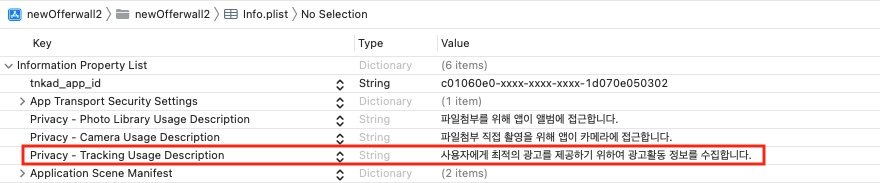
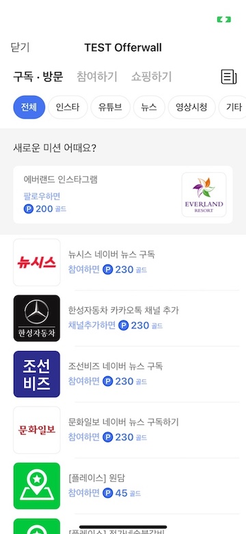

# offerwall sdk guide (iOS)

## list

1. [SDK Get Stared](#1-sdk-get-stared)
    * 1.1 [sdk download](#11-sdk-download)
    * 1.2 [Add SDK to Project](#12-add-sdk-to-project)
    * 1.3 [ATT (App Tracking Transparency) popup](#13-att-app-tracking-transparency-popup)
    * 1.4 [add usage description for permission](#14-add-usage-description-for-permission)
    * 1.5 [initialize TnkSession object](#15-initialize-tnksession-object)
2. [show offerwall](#2-show-offerwall)
    * 2.1 [Setup user identification](#21-setup-user-identification)
    * 2.2 [AdOfferwallViewController](#22-adofferwallviewcontroller)
    * 2.3 [AdOfferwallView](#23-adofferwallview)
       * [OfferwallEventListener](#offerwalleventlistener)
    * 2.4 [use in SwiftUI](#24-use-in-swiftui)
3. [Publisher API](#3-publisher-api)
    * 3.1 [QueryPublishState](#31-querypublishstate)
    * 3.2 [queryAdvertiseCount](#32-queryadvertisecount)
    * 3.3 [Point check and withdrawal](#33-point-check-and-withdrawal)
       *  [queryPoint](#querypoint)
       *  [purchaseItem](#purchaseitem)
       *  [withdrawPoints](#withdrawpoints)
    * 3.4 [Callback URL](#34-callback-url)
4. [disign customization](#4-disign-customization)
5. [placement view](#5-placement-view)


## 1. SDK Get Stared

### 1.1 sdk download

**[[iOS Reward SDK2 Download v5.28](./sdk/TnkRewardSDK2_v5.28.zip)]**

### 1.2 Add SDK to Project

When you unpack the downloaded SDK file, the TnkRwdSdk.2xcframework folder is created. Move the folder to the XCode project folder you want to apply.

TnkRwdSDK if you moved the folder. Drag the xcframework folder into the XCode. After that verify that TnkRwdSdk2.xcframework is present in the XCode -> Target -> General -> Frames, Libraries, and Embedded Content entries, and change the Embedded setting to Embedded & Sign.

Please refer to the image below.


### 1.3 ATT (App Tracking Transparency) popup

ATT popup is required to get user's permission for tracking user's ad activity. ATT popup is provided by iOS 14 or later. We recommend to show ATT popup when your app is launched. [Learn more about ATT](https://developer.apple.com/kr/app-store/user-privacy-and-data-use/)

If user denies ATT popup, ad will be limited.


#### show ATT popup

add "Privacy - Tracking Usage Description" to info.plist file. this description will be shown in ATT popup.

example) We collect ad activity information to provide user with optimized ads.



call below api to show ATT popup. [Learn more about AppTrackingTransparency API](https://developer.apple.com/documentation/apptrackingtransparency)

```swift
import AppTrackingTransparency

if #available(iOS 14, *) {
    ATTrackingManager.requestTrackingAuthorization { status in
                // ...
    }
 }
```

or you can use sdk api to show ATT popup. (show ATT popup when app is launched)

```swift
import TnkRwdSdk2

TnkAlerts.showATTPopup(viewController,
                       agreeAction: {
                           // user agree
                       },
                       denyAction:{
                           // user deny
                       })

```


### 1.4 add usage description for permission

many of offerwall ads require to attach image file. to attach image file, you need to add usage description for photo library and camera to info.plist file.

see below image.


### 1.5 initialize TnkSession object

you need to get **APP-ID** value from [Tnk site](https://tnkfactory.com) to use sdk. **APP-ID** value is used to initialize TnkSession object. there are 2 ways to initialize TnkSession object. you can choose one of below ways.

#### call initialize api

Initialize the TnkSession object before adding the TnkAd SDK. usually add this code to applicationDidFinishLaunchingWithOption method in Application Delegate. replace **your-app-id-from-tnk-site** to your **APP-ID** value.

```swift
// Swift
import TnkRwdSdk2

TnkSession.initInstance(appId: "your-app-id-from-tnk-site")
```

```objective-c
// Objective-C
#import <TnkRwdSdk2/TnkRwdSdk2.h>

[TnkSession initInstanceWithAppId:@"your-app-id-from-tnk-site"];
```

#### add 'tnkad app id' to info.plist file

add `tnkad_app_id` item to info.plist file. set your **APP-ID** value to this item. if you set **APP-ID** value to this item, TnkSession object will be initialized automatically when TnkSession object is used first time.


## 2. show offerwall

### 2.1 Setup user identification

To show offerwall, you need to set user name to SDK. user name is usually user's login id. if user name is phone number or email, we recommend to use hash function like SHA256.

You must set user name. if you don't set user name, offerwall will not be shown. and user name is passed to callback url when user earns point. 

```swift

add below code to set user name.

```swift
// Swift
import TnkRwdSdk2

TnkSession.sharedInstance()?.setUserName("<user name>")
```

```objective-c
// Objective-C
#import <TnkRwdSdk2/TnkRwdSdk2.h>

[[TnkSession sharedInstance] setUserName:@"<user name>"];
```

### 2.2 AdOfferwallViewController

easiest way to show offerwall is using **AdOfferwallViewController**. AdOfferwallViewController can be used like UIViewController. below example is how to show AdOfferwallViewController with UINavigationController as modal.

```swift
// Swift
import TnkRwdSdk2

func showOfferwall() {
    let vc = AdOfferwallViewController()
    vc.title = "TEST Offerwall"
        
    let navController = UINavigationController(rootViewController: vc)
    navController.modalPresentationStyle = .fullScreen
    navController.navigationBar.titleTextAttributes = [.foregroundColor: UIColor.black]

    self.present(navController, animated: true)
}
```

```objective-c
// Objective-C
#import <TnkRwdSdk2/TnkRwdSdk2.h>

- (void)showOfferwall {
    UIViewController *vc = [[AdOfferwallViewController alloc] init];
    vc.title = @"TEST Offerwall";
    
    UINavigationController *navController = [[UINavigationController alloc] initWithRootViewController:vc];
    navController.modalPresentationStyle = UIModalPresentationFullScreen;
    navController.navigationBar.titleTextAttributes = @{NSForegroundColorAttributeName: UIColor.blackColor};
    
    [self presentViewController:navController animated:YES completion:nil];
}
```



### 2.3 AdOfferwallView

if you want to use offerwall as UIView, you can use **AdOfferwallView**. AdOfferwallView can be used like UIView. you need to call loadData() function to load ad list. below example is how to add AdOfferwallView to UIViewController and load ad list.

```swift
// Swift
import TnkRwdSdk2

func loadOfferwall() {
        
    let offerwallView = AdOfferwallView(frame:view.frame, viewController: self)
    //offerwallView.offerwallListener = self  // see OfferwallEventListener below
    
    view.addSubview(offerwallView)
        
    offerwallView.translatesAutoresizingMaskIntoConstraints = false
    NSLayoutConstraint.activate([
        offerwallView.leadingAnchor.constraint(equalTo: view.leadingAnchor),
        offerwallView.trailingAnchor.constraint(equalTo: view.trailingAnchor),
        offerwallView.topAnchor.constraint(equalTo: view.topAnchor),
        offerwallView.bottomAnchor.constraint(equalTo: view.bottomAnchor),
    ])
        
    offerwallView.loadData()        

}
```

```objective-c
// Objective-C
#import <TnkRwdSdk2/TnkRwdSdk2.h>

- (void)loadOfferwall {
    AdOfferwallView *offerwallView = [[AdOfferwallView alloc] initWithFrame:self.view.frame viewController:self];
    //offerwallView.offerwallListener = self;  // see OfferwallEventListener below
    
    [self.view addSubview:offerwallView];
    
    offerwallView.translatesAutoresizingMaskIntoConstraints = NO;
    [NSLayoutConstraint activateConstraints:@[
        [offerwallView.leadingAnchor constraintEqualToAnchor:self.view.leadingAnchor],
        [offerwallView.trailingAnchor constraintEqualToAnchor:self.view.trailingAnchor],
        [offerwallView.topAnchor constraintEqualToAnchor:self.view.topAnchor],
        [offerwallView.bottomAnchor constraintEqualToAnchor:self.view.bottomAnchor],
    ]];
    
    [offerwallView loadData];
}
```

#### OfferwallEventListener

you can receive offerwall events using OfferwallEventListener protocol. below is protocol definition.

```swift

/// OfferwallEventListener is used to receive offerwall events.
/// OfferwallEventListener is set to offerwallListener property of AdOfferwallView or AdOfferwallViewController.
public protocol OfferwallEventListener : NSObjectProtocol {

    /// This method is called when ad list is loaded.
    ///
    /// - Parameters:
    ///   - headerMessage: header message from Tnk site. this message is optional.
    ///   - totalPoint: total point that user can earn.
    ///   - totalCount : total count of ads that user can earn.
    ///   - multiRewardPoint: if user is participating in multi reward campaign, this value is remaining point of multi reward campaign.
    ///   - multiRewardCount: if user is participating in multi reward campaign, this value is count of multi reward campaign.
    func didAdDataLoaded(headerMessage:String?,
                         totalPoint:Int, totalCount:Int,
                         multiRewardPoint:Int, multiRewardCount:Int)
    
    /// This method is called when menu or filter is selected.
    ///
    /// - Parameters:
    ///   - menuId: id of selected menu.
    ///   - menuName : name of selected menu.
    ///   - filterId: id of selected filter.
    ///   - filterName: name of selected filter.
    func didMenuSelected(menuId:Int, menuName:String, filterId:Int, filterName:String)
    
    /// This method is called when ad is clicked.
    ///
    /// - Parameters:
    ///   - appId : id of clicked ad.
    ///   - appName : name of clicked ad.
    func didAdItemClicked(appId:Int, appName:String)
    
    /// This method is called when offerwall is closed.
    func didOfferwallRemoved()
    
}
```

you can set OfferwallEventListener to AdOfferwallView.offerwallListener or AdOfferwallViewController.offerwallListener. see below example.

```swift
// Swift
import TnkRwdSdk2

class ViewController: UIViewController, OfferwallEventListener {

    func loadOfferwall() {
        
        let offerwallView = AdOfferwallView(frame:view.frame, viewController: self)
        offerwallView.offerwallListener = self  // Listener 설정
    
        // ...
        
        offerwallView.loadData()        
    }

    // MARK: OfferwallEventListener
    
    func didAdDataLoaded(headerMessage: String?,
                         totalPoint: Int,
                         totalCount: Int,
                         multiRewardPoint: Int,
                         multiRewardCount: Int) {
        print("### message = \(headerMessage)")
    }
    
    func didMenuSelected(menuId: Int, menuName:String, filterId: Int, filterName:String) {
        print("### menuId: \(menuId) \(menuName), filterId: \(filterId) \(filterName)")
    }
    
    func didAdItemClicked(appId: Int, appName: String) {
        print("### adItem: \(appId) \(appName)")
    }
    
    func didOfferwallRemoved() {
        print("### offerwall removed")
    }
```

```objective-c
// Objective-C
#import <TnkRwdSdk2/TnkRwdSdk2.h>

@interface ViewController : UIViewController <OfferwallEventListener>
// ...
@end

@implementation ViewController

- (void)loadOfferwall {
    AdOfferwallView *offerwallView = [[AdOfferwallView alloc] initWithFrame:self.view.frame viewController:self];
    offerwallView.offerwallListener = self;  // Listener 설정
    
    // ...
    
    [offerwallView loadData];
}

#pragma mark OfferwallEventListener

- (void)didAdDataLoadedWithHeaderMessage:(NSString *)headerMessage
                              totalPoint:(NSInteger)totalPoint
                              totalCount:(NSInteger)totalCount
                        multiRewardPoint:(NSInteger)multiRewardPoint
                        multiRewardCount:(NSInteger)multiRewardCount {
    NSLog(@"### message = %@", headerMessage);
}

- (void)didMenuSelectedWithMenuId:(NSInteger)menuId menuName:(NSString *)menuName
                         filterId:(NSInteger)filterId filterName:(NSString *)filterName {
    NSLog(@"### menuId: %ld %@, filterId: %ld %@", menuId, menuName, filterId, filterName);
}

- (void)didAdItemClickedWithAppId:(NSInteger)appId appName:(NSString *)appName {
    NSLog(@"### adItem: %ld %@", appId, appName);
}

- (void)didOfferwallRemoved {
    NSLog(@"### offerwall removed");
}
```

### 2.4 use in SwiftUI

you can use AdOfferwallView in SwiftUI. below is example.

```swift
// SwiftUI

struct OfferwallViewController : UIViewControllerRepresentable {
    func makeUIViewController(context: Context) -> AdOfferwallViewController {
        AdOfferwallViewController()
    }
    
    func updateUIViewController(_ uiViewController: AdOfferwallViewController, context: Context) {
        uiViewController.loadOfferwall()
    }
}

struct SwiftUIView: View {    
    var body: some View {
        OfferwallViewController()
    }
}

```

## 3. Publisher API

### 3.1 QueryPublishState 

If you stop posting ads in [Post Information] on the Tnk site, the ads will not appear even if the user displays the ads list window.
Therefore, it is recommended that the charging station button itself is not visible on the screen in case you stop posting ads in the future.
To this end, it provides a method to inquire the status of the ads posting of the current publishing app.

- func **queryPublishState(completion:@escaping (Int)->Void)**
    - Parameters
        - completion: call back function. this function is called when query is finished.
    - example

```swift
// Swift 
TnkSession.sharedInstance()?.queryPublishState() {
    (state) in
    print("#### queryPublishState \(state)")
}
```

- func **queryPublishState(target:NSObject, action:Selector)**
    - Parameters
       - target: call action method of this object when query is finished.
       - action: when query is finished, this method is called. this method should have 1 parameter of NSNumber type. publish state value is passed to this parameter.

```swift
// Swift 

TnkSession.sharedInstance()?.queryPublishState(target: self, action: #selector(didReceivedPublishState(_:)))

@objc
func didReceivedPublishState(_ state:NSNumber) {
    print("#### queryPublishState \(state)")
}
```

```objective-c
// Objective-C

[[TnkSession sharedInstance] queryPublishStateWithTarget:self action:@selector(didReceivedPublishState:)];

- (void)didReceivedPublishState:(NSNumber*) state {
    NSLog(@"#### queryPublishState %@", state);
}
```

- publish state value
    - publish state value is defined in PublisherState class. 
    - 1 : normal
    - 2 : testing
    - other : stop publishing 

```swift
// Swift
 
public class PublisherState : NSObject {
    static public let notFound:Int = 0
    static public let normal:Int = 1
    static public let testing:Int = 2
    static public let verifying:Int = 3
}
```

### 3.2 queryAdvertiseCount

you can check publish state and hide offerwall button if you stop publishing ads. but if you show how many ads user can earn and how many points user can earn, it will attract more users. you can query this information using below api.

- func **queryAdvertiseCount(completion:@escaping (Int,Int)->Void)**
    - Parameters
        - completion: call back function. this function is called when query is finished. count of ads that user can earn and total point that user can earn are passed to this function.
    - example

```swift
// Swift 
TnkSession.sharedInstance()?.queryAdvertiseCount() {
    (count, point) in
    print("### queryAdvertiseCount \(count) \(point)")
}
```

- func **queryAdvertiseCount(target:NSObject, action:Selector)**
    - Parameters
        - target: call action method of this object when query is finished.
        - action: when query is finished, this method is called. this method should have 2 parameters of NSNumber type. count of ads that user can earn and total point that user can earn are passed to these parameters.

```swift
// Swift 

TnkSession.sharedInstance()?.queryAdvertiseCount(target:self, action: #selector(didReceivedAdvertiseCount(_:_:)))

@objc
func didReceivedAdvertiseCount(_ count:NSNumber,  _ point:NSNumber) {
    print("### queryAdvertiseCount \(count) \(point)")
}
```

```objective-c
// Objective-C

[[TnkSession sharedInstance] queryAdvertiseCountWithTarget:self action:@selector(didReceivedAdvertiseCount:point:)];

- (void)didReceivedAdvertiseCount:(NSNumber*)count point:(NSNumber *)point {
    NSLog(@"### queryAdvertiseCount %@ %@", count, point);
}
```

### 3.3 Point check and withdrawal

Points acquired by users through ads participation can be managed by the TNK server or by the app's yours server.
If the points are managed by the TNK server, you can use the following point check and withdrawal API to implement the required item purchase method.

#### queryPoint

query user point from Tnk server.

- func **queryPoint(completion:@escaping (Int)->Void)**
    - Parameters
        - completion: call back function. this function is called when query is finished. user's point is passed to this function.
    - example

```swift
// Swift 
TnkSession.sharedInstance()?.queryPoint() {
    (point) in
    print("#### queryPoint \(point)")
}
```


- func **queryPoint(target:NSObject, action:Selector)**
    - Parameters
        - target: call action method of this object when query is finished.
        - action: when query is finished, this method is called. this method should have 1 parameter of NSNumber type. user's point is passed to this parameter.

```swift
// Swift 

TnkSession.sharedInstance()?.queryPoint(target:self, action: #selector(didReceivedPoint(_:)))

@objc
func didReceivedPoint(_ point:NSNumber) {
    print("### queryPoint \(point)")
}
```

```objective-c
// Objective-C

[[TnkSession sharedInstance] queryPointWithTarget:self action:@selector(didReceivedPoint:)];

- (void)didReceivedPoint:(NSNumber*) point {
    NSLog(@"### queryPoint %@", point);
}
```

#### purchaseItem

The TnK server does not provide the ability to manage the list of items.
However, when a user purchases an item provided by the posting app, you can deduct the corresponding point to the Tnk server.


- func **purchaseItem(_ itemId:String, cost:Int, completion:@escaping (Int,Int)->Void)**
    - Parameters
        - itemId: id of item to purchase. you can set any value to this parameter. this value is shown in purchase list page of Tnk site.
        - cost: Points to be deducted
        - completion: call back function. this function is called when purchase is finished. remaining point and transaction id are passed to this function. if purchase is failed, remaining point is negative value.
    - example

```swift
// Swift 
TnkSession.sharedInstance()?.purchaseItem("remove ad", cost: 1000) {
    (remainPoint, trId) in
    print("#### purchaseItem \(remainPoint) \(trId)")
}
```

- func **purchaseItem(_ itemId:String, cost:Int, target:NSObject, action:Selector)**
    - Parameters
        - itemId: id of item to purchase. you can set any value to this parameter. this value is shown in purchase list page of Tnk site.
        - cost: Points to be deducted
        - target: call action method of this object when purchase is finished.
        - action: Specifies the method to be called when the result is received. Two NSNumber objects are received as parameters, and the remaining point values after deduction are delivered to the first parameter, and the unique transaction Id value is delivered to the second parameter. If the purchase is not performed due to a lack of points or a network/system error, a negative number is transmitted to the second parameter value.
    - example

```swift
// Swift 

TnkSession.sharedInstance()?.purchaseItem("remove ad", cost: 1000, target: self,
                                           action: #selector(didReceivedPurchaseReturn(_:_:)))
@objc
func didReceivedPurchaseReturn(_ remainPoint:NSNumber, _ trId:NSNumber) {
    print("### purchaseItem \(remainPoint) \(trId)")
}
```

```objective-c
// Objective-C

[[TnkSession sharedInstance] purchaseItem:@"remove ad" cost:1000 target:self 
                                   action:@selector(didReceivedPurchaseReturn:trId:)];

- (void)didReceivedPurchaseReturn:(NSNumber*)remainPoint trId:(NSNumber *)trId {
    NSLog(@"### purchaseItem %@ %@", remainPoint, trId);
}
```

#### withdrawPoints

Ability to withdraw all managed user points from the Tnk server

- func **withdrawPoints(_ desc:String, completion:@escaping (Int,Int)->Void)**
    - Parameters
        - desc: description of withdrawal. this value is shown in report page of Tnk site.
        - completion: call back function. this function is called when withdrawal is finished. withdrawn point and transaction id are passed to this function.
    - example

```swift
// Swift 
TnkSession.sharedInstance()?.withdrawPoints("전체인출") {
    (point, trId) in
    print("#### withdrawPoints \(point) \(trId)")
}
```


- func **withdrawPoints(_ desc:String, target:NSObject, action:Selector)**
    - Parameters
        - desc: description of withdrawal. this value is shown in report page of Tnk site.
        - target: call action method of this object when withdrawal is finished.
        - action: when withdrawal is finished, this method is called. this method should have 2 parameters of NSNumber type. withdrawn point and transaction id are passed to these parameters.
    - example
```swift
// Swift 

TnkSession.sharedInstance()?.withdrawPoints("withdrawPoints", target:self, action: #selector(didReceivedWithdrawPoints(_:_:)))

@objc
func didReceivedWithdrawPoints(_ point:NSNumber, _ trId:NSNumber) {
    print("### withdrawPoints \(point) \(trId)")
}
```

```objective-c
// Objective-C

[[TnkSession sharedInstance] withdrawPoints:@"withdrawPoints" target:self action:@selector(didReceivedWithdrawPoints:trId:)];

- (void)didReceivedWithdrawPoints:(NSNumber*)point trId:(NSNumber *)trId {
    NSLog(@"### withdrawPoints %@ %@", point, trId);
}
```

### 3.4 Callback URL

If the user manages the points obtained through ads participation on the developer's server, proceed as follows.

* On the app Information Settings screen, select the 'Point Management' item as 'Manage from your own server' as shown below.
* In URL entry, enter the URL to receive point accumulation information.

After that, the user can receive the accumulation information at the URL above in real time whenever the points are accumulated.

#### request method

HTTP POST

#### Parameters

| parameter  | description                                                  | max length |
| ---------- | ------------------------------------------------------------ | ---------- |
| seq_id     | unique ID for point payment. even if the URL is called repeatedly, you can check whether the payment is duplicated using this value. | string(50)  |
| pay_pnt    | point value to be paid to the user.                          | long       |
| md_user_nm | This is a value passed to identify the user in the posting app. To receive this value, set the user identification value in the posting app using the setUserName() API in the posting app. | string(256) |
| md_chk     | This is provided to determine whether the transmitted value is valid. This value is the MD5 Hash value of app_key + md_user_nm + seq_id. The app_key value is the value assigned when the app is registered and can be checked on the Tnk site. | string(32)  |
| app_id     | unique ID value of the ad app that the user participated in. | long       |
| pay_dt     | point payment time. (System milliseconds) ex) 1577343412017  | long       |
| app_nm     | name of participated ad.                                     | string(120) |
|pay\_amt|amount to be settled.|long|
|actn\_id|<p>- 0 : install</p><p>- 1 : launch</p><p>- 2 : action</p><p>- 5 : purchase</p>|int|

#### return value

Tnk server calls the above URL and determines that it has been processed normally when 200 is returned to the HTTP return code.
If a value other than 200 is returned, the Tnk server determines that it is abnormal and then repeatedly calls every 5 minutes and 1 hour for up to 24 hours.

- Cautions! same request can be repeatedly called, so you must double check using the seq_id value.

#### Callback URL implementation example (Java)

```java
// Points paid to that user
class TnkCallbackListener {
    
    void onPointPaid(HttpPostParams request) {
        int payPoint = Integer.parseInt(request.getParameter("pay_pnt"));

        // Unique number generated inside the tnk id.
        String seqId = request.getParameter("seq_id");

        // It is used to determine whether the transmitted parameters are valid or not. (See Coding Below)
        String checkCode = request.getParameter("md_chk");

        // The used (phone numbers or login id) value used in the app for posting tnksession setUserName() is set to to be after.
        String mdUserName = request.getParameter("md_user_nm");

        // App_key granted when registering the app (can be checked on tnk site)
        String appKey = "d2bbd...........19c86c8b021";

        // To create verifycode as the order to verify the validity.The DigestUtils는 apache commons - codec.jar this necessary. If safe to use it. There is a different hash method for the md2
        String verifyCode = DigestUtils.md5Hex(appKey + mdUserName + seqId);

        // If the generated verifyCode and chk_cd parameter values do not match, this is an invalid request
        if (checkCode == null || !checkCode.equals(verifyCode)) {

            // error
            log.error("tnkad() check error : " + verifyCode + " != " + checkCode);
        } else {
            // success
            log.debug("tnkad() : " + mdUserName + ", " + seqId);

            //Perform logic to grant points (example)
            purchaseManager.getPointByAd(mdUserName, payPoint, seqId);

        }
    }
}
```

## 4. disign customization

[UI customization guide](./UI_Customizing.md)

## 5. placement view

[placement view guide](./AdPlacementView.md)